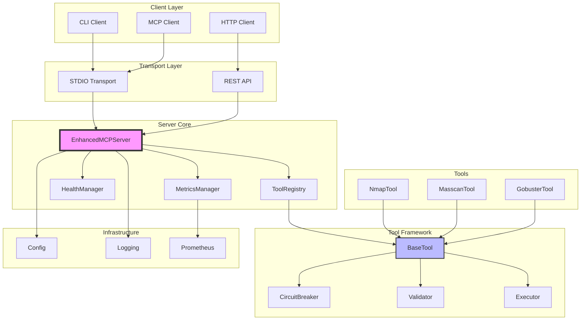
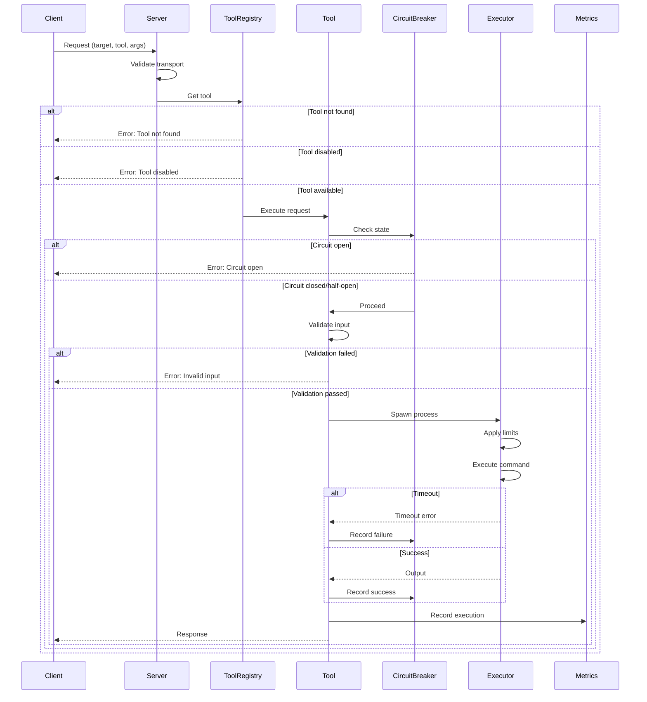
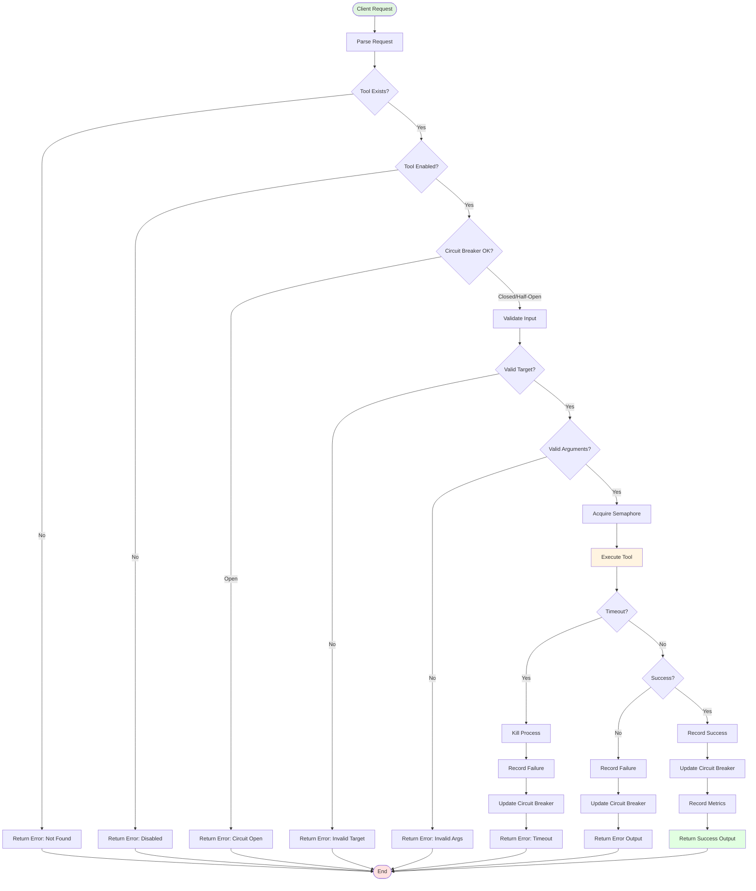

# MCP Server - Project Architecture Document

## Table of Contents
1. [Executive Summary](#executive-summary)
2. [System Overview](#system-overview)
3. [Project Structure](#project-structure)
4. [Architecture Diagrams](#architecture-diagrams)
5. [Core Components](#core-components)
6. [Tool System](#tool-system)
7. [Security Architecture](#security-architecture)
8. [Configuration System](#configuration-system)
9. [Adding New Tools](#adding-new-tools)
10. [API Reference](#api-reference)
11. [Deployment Guide](#deployment-guide)
12. [Troubleshooting](#troubleshooting)
13. [Glossary](#glossary)

---

## Executive Summary

The MCP (Machine Control Protocol) Server is a production-ready, extensible framework for executing and managing security tools with enterprise-grade reliability, monitoring, and safety features. It provides a unified interface for tool execution with built-in circuit breakers, health monitoring, metrics collection, and comprehensive security controls.

### Key Features
- **Multi-transport Support**: stdio and HTTP/REST API
- **Circuit Breaker Pattern**: Automatic failure detection and recovery
- **Health Monitoring**: Real-time system and tool health checks
- **Metrics & Observability**: Prometheus-compatible metrics
- **Security-First Design**: Input validation, rate limiting, sandboxing
- **Extensible Architecture**: Easy tool addition through inheritance

### Design Principles
1. **Safety First**: All operations are validated and sandboxed
2. **Fail Fast**: Early detection and handling of errors
3. **Observable**: Comprehensive logging and metrics
4. **Extensible**: Simple interfaces for adding new capabilities
5. **Production-Ready**: Built for reliability and scale

---

## System Overview

The MCP Server operates as a command orchestration system that safely executes security tools while providing enterprise features like monitoring, circuit breaking, and metrics collection.

### Core Capabilities
- **Tool Execution**: Safe, controlled execution of system tools
- **Resource Management**: Concurrency limits, timeouts, output size limits
- **Failure Handling**: Circuit breakers, retries, graceful degradation
- **Monitoring**: Health checks, metrics, logging
- **Multi-Transport**: stdio for CLI, HTTP for services

---

## Project Structure

### File Hierarchy

```
mcp-server/
├── mcp_server/
│   ├── __init__.py              # Package initialization
│   ├── server.py                 # Main server implementation
│   ├── base_tool.py             # Base class for all tools
│   ├── config.py                # Configuration management
│   ├── health.py                # Health monitoring system
│   ├── metrics.py               # Metrics collection
│   ├── circuit_breaker.py      # Circuit breaker implementation
│   │
│   └── tools/                   # Tool implementations
│       ├── __init__.py
│       ├── nmap_tool.py         # Nmap network scanner
│       ├── masscan_tool.py      # Masscan port scanner
│       └── gobuster_tool.py     # Gobuster enumeration
│
├── tests/                       # Test suite
│   ├── __init__.py
│   ├── test_server.py
│   ├── test_base_tool.py
│   ├── test_config.py
│   ├── test_health.py
│   ├── test_metrics.py
│   ├── test_circuit_breaker.py
│   └── test_tools/
│       ├── test_nmap_tool.py
│       ├── test_masscan_tool.py
│       └── test_gobuster_tool.py
│
├── config/                      # Configuration files
│   ├── config.yaml             # YAML configuration
│   └── config.json             # JSON configuration
│
├── docs/                       # Documentation
│   ├── API.md                  # API documentation
│   ├── TOOLS.md                # Tool documentation
│   └── DEPLOYMENT.md           # Deployment guide
│
├── scripts/                    # Utility scripts
│   ├── install.sh              # Installation script
│   └── health_check.py         # Health check utility
│
├── .env.example                # Environment template
├── docker-compose.yml          # Docker composition
├── Dockerfile                  # Container definition
├── requirements.txt            # Python dependencies
├── pyproject.toml             # Project metadata
└── README.md                  # Project documentation
```

---

## Architecture Diagrams

### Component Architecture



### Data Flow Diagram



### Tool Execution Flow



---

## Core Components

### 1. **server.py** - Main Server Implementation

**Purpose**: Orchestrates the entire MCP server, managing transports, tools, and monitoring.

**Key Classes**:
- `EnhancedMCPServer`: Main server class
- `ToolRegistry`: Tool management and registration

**Interfaces**:
```python
class EnhancedMCPServer:
    def __init__(self, tools: List[MCPBaseTool], transport: str = "stdio", config=None)
    async def run(self) -> None
    async def run_stdio_original(self) -> None
    async def run_http_enhanced(self) -> None
```

**Dependencies**:
- `config.py`: Configuration management
- `health.py`: Health monitoring
- `metrics.py`: Metrics collection
- `base_tool.py`: Tool framework

### 2. **base_tool.py** - Tool Framework

**Purpose**: Provides the base class and framework for all tool implementations.

**Key Classes**:
- `MCPBaseTool`: Abstract base class for tools
- `ToolInput`: Input validation model
- `ToolOutput`: Output structure model
- `ErrorContext`: Error handling context

**Interfaces**:
```python
class MCPBaseTool(ABC):
    async def run(self, inp: ToolInput, timeout_sec: Optional[float] = None) -> ToolOutput
    async def _execute_tool(self, inp: ToolInput, timeout_sec: Optional[float] = None) -> ToolOutput
    async def _spawn(self, cmd: Sequence[str], timeout_sec: float) -> ToolOutput
```

**Key Features**:
- Input validation
- Resource limits (CPU, memory, output size)
- Circuit breaker integration
- Metrics collection
- Error handling

### 3. **config.py** - Configuration Management

**Purpose**: Centralized configuration with hot-reload, validation, and multiple sources.

**Key Classes**:
- `MCPConfig`: Main configuration class
- Various dataclasses for configuration sections

**Interfaces**:
```python
def get_config(config_path: Optional[str] = None, force_new: bool = False) -> MCPConfig
def reset_config() -> None

class MCPConfig:
    def load_config(self) -> None
    def reload_config(self) -> bool
    def save_config(self, file_path: Optional[str] = None) -> None
    def to_dict(self, redact_sensitive: bool = True) -> Dict[str, Any]
```

**Configuration Sources** (priority order):
1. Environment variables (highest)
2. Configuration file (YAML/JSON)
3. Default values (lowest)

### 4. **health.py** - Health Monitoring

**Purpose**: Comprehensive health monitoring with priority-based checks.

**Key Classes**:
- `HealthCheckManager`: Manages all health checks
- `SystemResourceHealthCheck`: CPU/memory/disk monitoring
- `ToolAvailabilityHealthCheck`: Tool availability verification
- `ProcessHealthCheck`: Process health monitoring

**Interfaces**:
```python
class HealthCheckManager:
    def add_health_check(self, health_check: HealthCheck, priority: int = 2) -> None
    def register_check(self, name: str, check_func: Callable, priority: int = 2) -> None
    async def run_health_checks(self) -> SystemHealth
    async def start_monitoring(self) -> None
```

**Health Check Priorities**:
- 0: Critical (any failure = system unhealthy)
- 1: Important (failures = system degraded)
- 2: Informational (logged but don't affect overall status)

### 5. **metrics.py** - Metrics Collection

**Purpose**: Metrics collection with Prometheus integration and memory management.

**Key Classes**:
- `MetricsManager`: Central metrics management
- `ToolMetrics`: Per-tool metrics wrapper
- `SystemMetrics`: System-wide metrics

**Interfaces**:
```python
class MetricsManager:
    def get_tool_metrics(self, tool_name: str) -> ToolMetrics
    def record_tool_execution(self, tool_name: str, success: bool, execution_time: float) -> None
    def get_all_stats(self) -> Dict[str, Any]
    def get_prometheus_metrics(self) -> Optional[str]
```

**Metrics Collected**:
- Execution count, success/failure rates
- Execution time (min, max, average, percentiles)
- Active executions
- Error types and frequencies

### 6. **circuit_breaker.py** - Resilience Pattern

**Purpose**: Implements circuit breaker pattern for failure isolation.

**Key Classes**:
- `CircuitBreaker`: Main circuit breaker implementation
- `CircuitBreakerState`: State enumeration (CLOSED, OPEN, HALF_OPEN)

**Interfaces**:
```python
class CircuitBreaker:
    async def call(self, func: Callable, *args, **kwargs) -> Any
    async def force_open(self) -> None
    async def force_close(self) -> None
    def get_stats(self) -> dict
```

**Features**:
- Adaptive timeout with exponential backoff
- Jitter to prevent thundering herd
- Comprehensive statistics
- Prometheus metrics integration

---

## Tool System

### Tool Base Class

All tools inherit from `MCPBaseTool` and must implement:

```python
class MyTool(MCPBaseTool):
    command_name: str = "mytool"  # System command to execute
    allowed_flags: Sequence[str] = ["-v", "--output"]  # Allowed command flags
    default_timeout_sec: float = 300.0  # Default timeout
    concurrency: int = 2  # Max concurrent executions
    
    # Optional: Override execution for custom logic
    async def _execute_tool(self, inp: ToolInput, timeout_sec: Optional[float] = None) -> ToolOutput:
        # Custom validation or processing
        return await super()._execute_tool(inp, timeout_sec)
```

### Existing Tools

#### **NmapTool** (`nmap_tool.py`)
- **Purpose**: Network discovery and security auditing
- **Features**: Port scanning, service detection, OS fingerprinting
- **Safety**: Network range limits, script validation, rate limiting

#### **MasscanTool** (`masscan_tool.py`)
- **Purpose**: Fast port scanning for large networks
- **Features**: High-speed scanning, banner grabbing
- **Safety**: Rate limiting, packet rate enforcement

#### **GobusterTool** (`gobuster_tool.py`)
- **Purpose**: Directory/DNS/vhost enumeration
- **Modes**: dir (directories), dns (subdomains), vhost (virtual hosts)
- **Safety**: Thread limits, wordlist validation

---

## Security Architecture

### Input Validation

1. **Target Validation**:
   - RFC1918 private IPs only (10.0.0.0/8, 172.16.0.0/12, 192.168.0.0/16)
   - `.lab.internal` hostnames
   - Network range size limits

2. **Argument Validation**:
   - Whitelist of allowed flags per tool
   - Length limits (default: 2048 bytes)
   - Metacharacter filtering
   - Token validation with regex

3. **Resource Limits**:
   - Execution timeout (default: 300s)
   - Output size limits (stdout: 1MB, stderr: 256KB)
   - Concurrency limits per tool
   - Network range size limits

### Process Isolation

- Subprocess execution with clean environment
- No shell execution (`shell=False`)
- Limited PATH environment
- Resource limits enforcement
- Process killing on timeout

### Network Safety

- Private network enforcement
- Rate limiting for network tools
- Circuit breaker for failure isolation
- Concurrent execution limits

---

## Configuration System

### Configuration Hierarchy

```yaml
# config.yaml example
server:
  host: 0.0.0.0
  port: 8080
  transport: http

tool:
  default_timeout: 300
  default_concurrency: 2

circuit_breaker:
  failure_threshold: 5
  recovery_timeout: 60.0

health:
  check_interval: 30.0
  cpu_threshold: 80.0
  memory_threshold: 80.0

metrics:
  enabled: true
  prometheus_enabled: true
```

### Environment Variable Override

All configuration can be overridden via environment variables:
- Pattern: `MCP_<SECTION>_<KEY>`
- Example: `MCP_SERVER_PORT=8080`

### Hot Reload

Configuration supports hot-reload for changes without restart:
```python
config = get_config()
if config.reload_config():
    log.info("Configuration reloaded")
```

---

## Adding New Tools

### Step-by-Step Guide

#### 1. Create Tool File

Create `mcp_server/tools/mytool_tool.py`:

```python
"""
MyTool - Example tool implementation.
"""
import logging
from typing import Optional, Sequence
from datetime import datetime, timezone

from mcp_server.base_tool import MCPBaseTool, ToolInput, ToolOutput, ToolErrorType, ErrorContext
from mcp_server.config import get_config

log = logging.getLogger(__name__)

class MyToolTool(MCPBaseTool):
    """
    MyTool implementation for [purpose].
    
    Features:
    - Feature 1
    - Feature 2
    
    Safety:
    - Input validation
    - Rate limiting
    """
    
    # Required: System command name
    command_name: str = "mytool"
    
    # Required: Allowed command-line flags
    allowed_flags: Sequence[str] = (
        "-v", "--verbose",
        "-o", "--output",
        # Add tool-specific flags
    )
    
    # Optional: Override defaults
    default_timeout_sec: float = 600.0  # 10 minutes
    concurrency: int = 1  # Single execution
    
    # Optional: Circuit breaker config
    circuit_breaker_failure_threshold: int = 5
    circuit_breaker_recovery_timeout: float = 120.0
    
    def __init__(self):
        """Initialize tool with configuration."""
        super().__init__()
        self.config = get_config()
        self._apply_config()
    
    def _apply_config(self):
        """Apply configuration settings."""
        # Read tool-specific config if needed
        pass
    
    async def _execute_tool(self, inp: ToolInput, timeout_sec: Optional[float] = None) -> ToolOutput:
        """
        Override for custom execution logic.
        """
        # Step 1: Validate tool-specific requirements
        validation_result = self._validate_requirements(inp)
        if validation_result:
            return validation_result
        
        # Step 2: Process arguments
        processed_args = self._process_arguments(inp.extra_args or "")
        
        # Step 3: Create enhanced input
        enhanced_input = ToolInput(
            target=inp.target,
            extra_args=processed_args,
            timeout_sec=timeout_sec or self.default_timeout_sec,
            correlation_id=inp.correlation_id,
        )
        
        # Step 4: Execute with base class
        return await super()._execute_tool(enhanced_input, enhanced_input.timeout_sec)
    
    def _validate_requirements(self, inp: ToolInput) -> Optional[ToolOutput]:
        """Validate tool-specific requirements."""
        # Add custom validation logic
        # Return None if valid, ToolOutput with error if invalid
        return None
    
    def _process_arguments(self, extra_args: str) -> str:
        """Process and optimize arguments."""
        # Add argument processing logic
        return extra_args
    
    def get_tool_info(self) -> dict:
        """Get tool information."""
        return {
            "name": self.tool_name,
            "command": self.command_name,
            "description": self.__doc__,
            "timeout": self.default_timeout_sec,
            "concurrency": self.concurrency,
            "allowed_flags": list(self.allowed_flags),
        }
```

#### 2. Add Tests

Create `tests/test_tools/test_mytool_tool.py`:

```python
import pytest
from mcp_server.tools.mytool_tool import MyToolTool
from mcp_server.base_tool import ToolInput

@pytest.mark.asyncio
async def test_mytool_basic():
    tool = MyToolTool()
    inp = ToolInput(target="192.168.1.1", extra_args="-v")
    result = await tool.run(inp)
    assert result.returncode == 0
```

#### 3. Register Tool

The tool is automatically discovered if placed in the tools package.
To explicitly include/exclude:

```bash
# Include only specific tools
TOOL_INCLUDE=MyToolTool,NmapTool

# Exclude specific tools
TOOL_EXCLUDE=GobusterTool
```

#### 4. Document Tool

Add to `docs/TOOLS.md`:
- Tool purpose and features
- Command-line examples
- Safety considerations
- Configuration options

### Tool Development Best Practices

1. **Validation First**: Always validate input before execution
2. **Safe Defaults**: Use conservative timeouts and concurrency
3. **Clear Errors**: Provide actionable error messages
4. **Resource Limits**: Respect system resource constraints
5. **Logging**: Log important operations and errors
6. **Metrics**: Record execution metrics for monitoring
7. **Documentation**: Document all features and safety measures

---

## API Reference

### HTTP API Endpoints

#### **Health Check**
```http
GET /health
```
Response:
```json
{
  "status": "healthy|degraded|unhealthy",
  "timestamp": "2024-01-01T00:00:00Z",
  "checks": {
    "system_resources": { "status": "healthy", "message": "..." },
    "tool_availability": { "status": "healthy", "message": "..." }
  }
}
```

#### **List Tools**
```http
GET /tools
```
Response:
```json
{
  "tools": [
    {
      "name": "NmapTool",
      "enabled": true,
      "command": "nmap",
      "description": "Network scanner"
    }
  ]
}
```

#### **Execute Tool**
```http
POST /tools/{tool_name}/execute
Content-Type: application/json

{
  "target": "192.168.1.1",
  "extra_args": "-v -A",
  "timeout_sec": 600,
  "correlation_id": "req-123"
}
```

#### **Enable/Disable Tool**
```http
POST /tools/{tool_name}/enable
POST /tools/{tool_name}/disable
```

#### **Metrics**
```http
GET /metrics
```
Returns Prometheus-formatted metrics or JSON statistics.

#### **Server-Sent Events**
```http
GET /events
```
Real-time health status updates via SSE.

### STDIO Protocol

For stdio transport, the server follows the MCP protocol specification.

---

## Deployment Guide

### Docker Deployment

```yaml
# docker-compose.yml
version: '3.8'
services:
  mcp-server:
    build: .
    ports:
      - "8080:8080"
    environment:
      - MCP_SERVER_TRANSPORT=http
      - MCP_SERVER_HOST=0.0.0.0
      - LOG_LEVEL=INFO
    volumes:
      - ./config:/app/config
      - ./logs:/app/logs
    healthcheck:
      test: ["CMD", "curl", "-f", "http://localhost:8080/health"]
      interval: 30s
      timeout: 10s
      retries: 3
```

### Kubernetes Deployment

```yaml
apiVersion: apps/v1
kind: Deployment
metadata:
  name: mcp-server
spec:
  replicas: 3
  selector:
    matchLabels:
      app: mcp-server
  template:
    metadata:
      labels:
        app: mcp-server
    spec:
      containers:
      - name: mcp-server
        image: mcp-server:latest
        ports:
        - containerPort: 8080
        env:
        - name: MCP_SERVER_TRANSPORT
          value: "http"
        livenessProbe:
          httpGet:
            path: /health
            port: 8080
          initialDelaySeconds: 30
          periodSeconds: 10
        resources:
          requests:
            memory: "256Mi"
            cpu: "500m"
          limits:
            memory: "512Mi"
            cpu: "1000m"
```

### SystemD Service

```ini
[Unit]
Description=MCP Server
After=network.target

[Service]
Type=simple
User=mcp
WorkingDirectory=/opt/mcp-server
ExecStart=/usr/bin/python3 -m mcp_server.server
Restart=always
RestartSec=10
Environment="MCP_SERVER_TRANSPORT=http"
Environment="LOG_LEVEL=INFO"

[Install]
WantedBy=multi-user.target
```

---

## Troubleshooting

### Common Issues

#### 1. **Tool Not Found**
```
Error: Command not found: nmap
```
**Solution**: Install the required tool:
```bash
apt-get install nmap  # Debian/Ubuntu
yum install nmap      # RHEL/CentOS
```

#### 2. **Circuit Breaker Open**
```
Error: Circuit breaker is open for NmapTool
```
**Solution**: 
- Check tool logs for repeated failures
- Wait for recovery timeout
- Force close if needed: `POST /tools/NmapTool/enable`

#### 3. **High Resource Usage**
```
Health check: CPU usage high: 85%
```
**Solution**:
- Reduce concurrency limits
- Adjust tool timeouts
- Check for runaway processes

#### 4. **Permission Denied**
```
Error: Permission denied executing tool
```
**Solution**:
- Check file permissions
- Verify user has execution rights
- Check SELinux/AppArmor policies

### Debug Mode

Enable debug logging:
```bash
LOG_LEVEL=DEBUG python -m mcp_server.server
```

### Health Check Script

```python
#!/usr/bin/env python3
import asyncio
import aiohttp

async def check_health():
    async with aiohttp.ClientSession() as session:
        async with session.get('http://localhost:8080/health') as resp:
            data = await resp.json()
            print(f"Status: {data['status']}")
            for check, result in data['checks'].items():
                print(f"  {check}: {result['status']}")

asyncio.run(check_health())
```

---

## Glossary

- **MCP**: Machine Control Protocol - The protocol for tool orchestration
- **Circuit Breaker**: Pattern that prevents cascading failures
- **Tool**: Executable security/network utility wrapped by the framework
- **Transport**: Communication method (stdio or HTTP)
- **Health Check**: Automated system health verification
- **Metrics**: Quantitative measurements of system performance
- **Correlation ID**: Unique identifier for tracking requests
- **Semaphore**: Concurrency control mechanism
- **RFC1918**: Private IP address ranges (10.0.0.0/8, 172.16.0.0/12, 192.168.0.0/16)

---

## Version History

- **v2.0.0** (Current): Production-ready with circuit breakers, health, metrics
- **v1.0.0**: Initial implementation with basic tool execution

---

## Contributing

1. Fork the repository
2. Create a feature branch
3. Add tests for new functionality
4. Ensure all tests pass
5. Update documentation
6. Submit pull request

---

## License

[Specify your license here]

---

## Support

For issues, questions, or contributions, please refer to the project repository.
